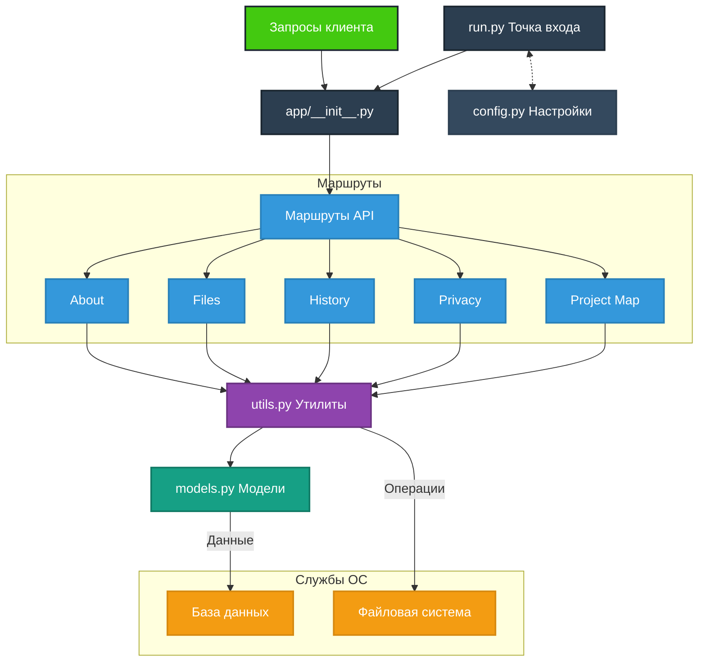

# Документация для приложения

Данный файл описывает основные компоненты приложения, их назначение и взаимодействие.

## Структура приложения

Приложение состоит из следующих основных компонентов:

### 1. **Маршруты (`routes`)**

**Описание:** Маршруты обрабатывают HTTP-запросы и предоставляют API для различных функций приложения.

- **Файлы (`files`)**: Управление файлами в проекте.
- **История (`history`)**: Логирование изменений и получение истории.
- **Политика конфиденциальности (`privacy`)**: Управление политикой конфиденциальности.
- **Карта проекта (`project_map`)**: Управление структурой проекта.
- **Описание (`about`)**: Управление общим описанием проекта.

Подробнее: [routes/README.md](routes/README.md)

### 2. **Модели (`models.py`)**

**Описание:** Определяет структуру базы данных и взаимодействие с ней через SQLAlchemy.

- Определение сущностей, таких как файлы и история изменений.
- Используется во всех маршрутах для работы с данными.

### 3. **Утилиты (`utils.py`)**

**Описание:** Вспомогательные функции для работы с базой данных, файлами и логированием.

- Обеспечивает повторно используемые функции для маршрутов.
- Минимизирует дублирование кода.

## Диаграмма компонентов приложения

## Интеграция

Все компоненты приложения связаны через маршруты и общую базу данных. Это обеспечивает модульность и гибкость в расширении функциональности.