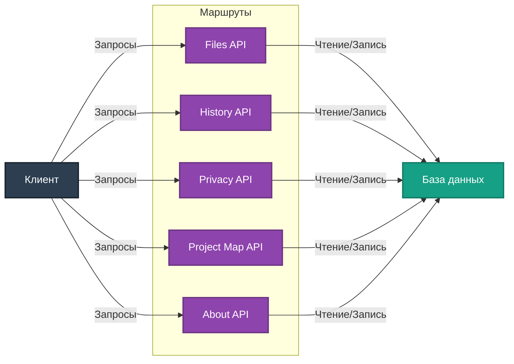

# Документация для маршрутов API

Данный файл описывает основные направления маршрутов, реализованных в проекте, их назначение и взаимодействие.

## Основные направления

### 1. Files (Работа с файлами)
**Описание**: Управление файлами в рамках проекта. Подразумевается создание, обновление и удаление файлов.
- Подробнее: [files/README.md](files/README.md)

### 2. History (История изменений)
**Описание**: Система ведения журнала изменений в проекте.
- Подробнее: [history/README.md](history/README.md)

### 3. Privacy (Политика конфиденциальности)
**Описание**: Управление политиками конфиденциальности на нескольких языках.
- Подробнее: [privacy/README.md](privacy/README.md)

### 4. Project Map (Карта проекта)
**Описание**: Управление картой проекта, включая синхронизацию с файловой системой.
- Подробнее: [project_map/README.md](project_map/README.md)

### 5. About (Описание проекта)
**Описание**: Управление основным описанием проекта.
- Подробнее: [about/README.md](about/README.md)

## Взаимодействие маршрутов

## Интеграция

Все маршруты зарегистрированы в `app/__init__.py` через Blueprints, что обеспечивает модульность и гибкость архитектуры приложения.