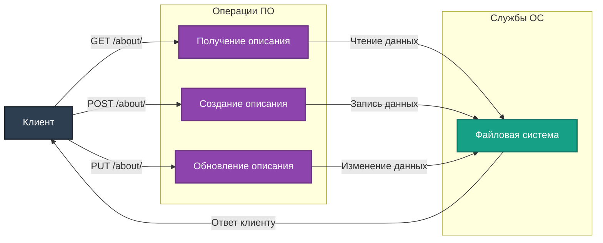

# Описание маршрутов "About"

Директория `app/routes/about` содержит маршруты для управления описанием проекта. Все маршруты используют `Blueprint` для модульности и удобства масштабирования.

## Подключение
Для регистрации маршрутов в приложении используется файл `app/__init__.py`:
```python
from app.routes.about import about_bp
app.register_blueprint(about_bp, url_prefix='/about')
```

## Маршруты

### 1. **GET /about/**
**Описание:** Получение описания проекта.

- **Параметры:** отсутствуют.
- **Ответы:**
  - `200 OK` – Возвращает JSON с описанием проекта.
  - `404 Not Found` – Файл описания отсутствует.

Пример ответа:
```json
{
    "description": "Описание проекта.",
    "created_at": 1671234567,
    "updated_at": 1671234567
}
```

---

### 2. **POST /about/**
**Описание:** Создание описания проекта.

- **Параметры (JSON):**
  - `description` (string, обязательный) – Текст описания проекта.

- **Ответы:**
  - `201 Created` – Описание успешно создано.
  - `400 Bad Request` – Описание уже существует или отсутствует параметр.

Пример запроса:
```json
{
    "description": "Это тестовый проект."
}
```

---

### 3. **PUT /about/**
**Описание:** Обновление описания проекта.

- **Параметры (JSON):**
  - `description` (string, обязательный) – Новый текст описания проекта.

- **Ответы:**
  - `200 OK` – Описание успешно обновлено.
  - `404 Not Found` – Файл описания отсутствует.
  - `400 Bad Request` – Отсутствует параметр.

Пример запроса:
```json
{
    "description": "Обновлённое описание проекта."
}
```

---

## Диаграмма взаимодействия



---

## Примечания
- Все маршруты используют `project_description.json` для хранения информации.
- Реализована обработка ошибок, таких как отсутствие файла или некорректные параметры запроса.