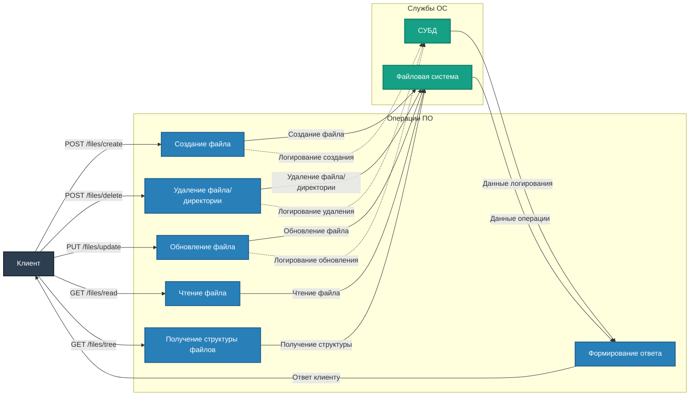

# Описание маршрутов "Files"

Директория `app/routes/files` содержит маршруты для управления файлами проекта. Все маршруты используют `Blueprint` для модульности и удобства масштабирования.

## Подключение
Для регистрации маршрутов в приложении используется файл `app/__init__.py`:
```python
from app.routes.files import files_bp
app.register_blueprint(files_bp, url_prefix='/files')
```

## Маршруты

### 1. **POST /files/create**
**Описание:** Создание нового файла в проекте.

- **Параметры (JSON):**
  - `path` (string, обязательный) – Путь к файлу.
  - `content` (string, необязательный) – Содержимое файла.
  - `description` (string, необязательный) – Описание файла.

- **Коды ответа:**
  - `201 Created` – Файл успешно создан.
  - `400 Bad Request` – Ошибки в параметрах или файл уже существует.

---

### 2. **POST /files/delete**
**Описание:** Удаление файла или директории из проекта.

- **Параметры (JSON):**
  - `path` (string, обязательный) – Путь к удаляемому файлу или директории.

- **Коды ответа:**
  - `200 OK` – Успешное удаление файла или директории.
  - `404 Not Found` – Указанный путь не найден.

---

### 3. **PUT /files/update**
**Описание:** Обновление информации и/или содержимого файла.

- **Параметры (JSON):**
  - `path` (string, обязательный) – Путь к файлу.
  - `description` (string, необязательный) – Новое описание файла.
  - `content` (string, необязательный) – Новое содержимое файла.

- **Коды ответа:**
  - `200 OK` – Файл успешно обновлён.
  - `404 Not Found` – Файл не найден.

---

### 4. **GET /files/read**
**Описание:** Чтение содержимого файла в проекте.

- **Параметры (Query String):**
  - `path` (string, обязательный) – Путь к читаемому файлу.

- **Коды ответа:**
  - `200 OK` – Возвращает содержимое файла, размер и время последнего изменения.
  - `404 Not Found` – Файл не найден.

---

### 5. **GET /files/tree**
**Описание:** Получение структуры файлов и папок в указанной директории.

- **Параметры (Query String):**
  - `path` (string, необязательный) – Относительный путь к директории (по умолчанию `BASE_DIR`).
  - `depth` (integer, необязательный) – Глубина обхода дерева (по умолчанию 3).
  - `excluded_dirs` (list of strings, необязательный) – Список директорий для исключения из результата.
  - `excluded_patterns` (list of strings, необязательный) – Паттерны для исключения директорий (например, `"__pycache__"`).

- **Коды ответа:**
  - `200 OK` – Возвращает дерево файлов и папок.
  - `400 Bad Request` – Некорректный путь (например, выход за пределы `BASE_DIR`).
  - `404 Not Found` – Указанный путь не существует.

- **Пример запроса:**
```
GET /files/tree?path=subdir&depth=2&excluded_patterns=__pycache__
```

- **Пример ответа:**
```json
{
    "directory": "/project/subdir",
    "subdirectories": ["/project/subdir/folder1", "/project/subdir/folder2"],
    "files": ["/project/subdir/file1.txt", "/project/subdir/file2.txt"]
}
```

---



## Примечания
- Для управления файлами используется файловая система и СУБД.
- Реализована обработка ошибок, таких как отсутствие файла или некорректные параметры запроса.