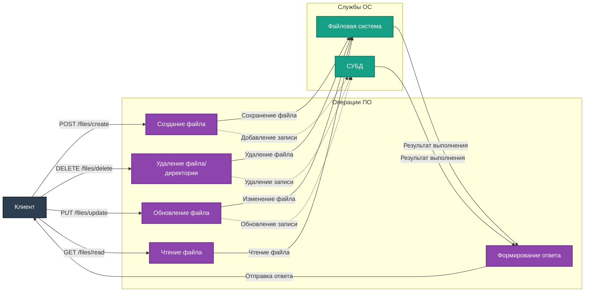

# Описание маршрутов "Files"

Директория `app/routes/files` содержит маршруты для управления файлами проекта. Все маршруты используют `Blueprint` для модульности и удобства масштабирования.

## Подключение
Для регистрации маршрутов в приложении используется файл `app/__init__.py`:
```python
from app.routes.files import files_bp
app.register_blueprint(files_bp, url_prefix='/files')
```

## Маршруты

### 1. **POST /files/create**
**Описание:** Создание нового файла в проекте.

- **Параметры (JSON):**
  - `path` (string, обязательный) – Путь к файлу.
  - `content` (string, необязательный) – Содержимое файла.
  - `description` (string, необязательный) – Описание файла.

- **Коды ответа:**
  - `201 Created` – Файл успешно создан.
  - `400 Bad Request` – Ошибки в параметрах или файл уже существует.

- **Пример запроса:**
```json
{
    "path": "example.txt",
    "content": "Hello, world!",
    "description": "Test file"
}
```

- **Пример ответа:**
```json
{
    "message": "File 'example.txt' created successfully."
}
```

---

### 2. **POST /files/delete**
**Описание:** Удаление файла или директории из проекта.

- **Параметры (JSON):**
  - `path` (string, обязательный) – Путь к удаляемому файлу или директории.

- **Коды ответа:**
  - `200 OK` – Успешное удаление файла или директории (включая рекурсивное удаление содержимого).
  - `207 Multi-status` – Успешное удаление файла или директории, но ошибка удаления его из СУБД.
  - `404 Not Found` – Указанный путь не найден.

- **Пример запроса:**
```json
{
    "path": "example.txt"
}
```

- **Пример ответа:**
```json
{
    "message": "File 'example.txt' deleted successfully."
}
```

- **Пример ответа (статус 207):**
```json
{
    "message": "File 'example.txt' deleted, but not found in database.",
    "status": "not_in_db"
}
```

---

### 3. **PUT /files/update**
**Описание:** Обновление информации и/или содержимого файла.

- **Параметры (JSON):**
  - `path` (string, обязательный) – Путь к файлу.
  - `description` (string, необязательный) – Новое описание файла.
  - `content` (string, необязательный) – Новое содержимое файла.

- **Коды ответа:**
  - `200 OK` – Файл успешно обновлён.
  - `404 Not Found` – Файл не найден.
  - `400 Bad Request` – Ошибки в параметрах.

- **Пример запроса:**
```json
{
    "path": "example.txt",
    "description": "Updated file description",
    "content": "Updated content"
}
```

- **Пример ответа:**
```json
{
    "message": "File 'example.txt' updated successfully."
}
```

---

### 4. **GET /files/read**
**Описание:** Чтение содержимого файла в проекте.

- **Параметры (Query String):**
  - `path` (string, обязательный) – Путь к читаемому файлу.

- **Коды ответа:**
  - `200 OK` – Возвращает содержимое файла, размер и время последнего изменения.
  - `404 Not Found` – Файл не найден.
  - `400 Bad Request` – Ошибки в параметрах.

- **Пример запроса:**
```
GET /files/read?path=example.txt
```

- **Пример ответа:**
```json
{
    "path": "example.txt",
    "content": "Hello, world!",
    "size": 13,
    "last_modified": 1672531200
}
```

---

## Диаграмма взаимодействия



---

## Примечания
- Для управления файлами используется файловая система и СУБД.
- Реализована обработка ошибок, таких как отсутствие файла или некорректные параметры запроса.