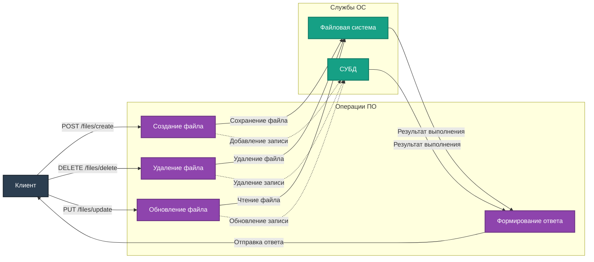

# Описание маршрутов "Files"

Директория `app/routes/files` содержит маршруты для управления файлами проекта. Все маршруты используют `Blueprint` для модульности и удобства масштабирования.

## Подключение
Для регистрации маршрутов в приложении используется файл `app/__init__.py`:
```python
from app.routes.files import files_bp
app.register_blueprint(files_bp, url_prefix='/files')
```

## Маршруты

### 1. **POST /files/create**
**Описание:** Создание нового файла в проекте.

- **Параметры (JSON):**
  - `filename` (string, обязательный) – Имя файла.
  - `content` (string, необязательный) – Содержимое файла.
  - `description` (string, необязательный) – Описание файла.

- **Ответы:**
  - `201 Created` – Файл успешно создан.
  - `400 Bad Request` – Ошибки в параметрах или файл уже существует.

---

### 2. **DELETE /files/delete**
**Описание:** Удаление файла из проекта.

- **Параметры (JSON):**
  - `path` (string, обязательный) – Путь к удаляемому файлу.

- **Ответы:**
  - `200 OK` – Файл успешно удалён.
  - `404 Not Found` – Файл не найден.

---

### 3. **PUT /files/update**
**Описание:** Обновление информации о файле.

- **Параметры (JSON):**
  - `path` (string, обязательный) – Путь к файлу.
  - `description` (string, обязательный) – Новое описание файла.

- **Ответы:**
  - `200 OK` – Файл успешно обновлён.
  - `404 Not Found` – Файл не найден.
  - `400 Bad Request` – Ошибки в параметрах.

---

## Диаграмма взаимодействия



---

## Примечания
- Для управления файлами используется файловая система и СУБД.
- Реализована обработка ошибок, таких как отсутствие файла или некорректные параметры запроса.