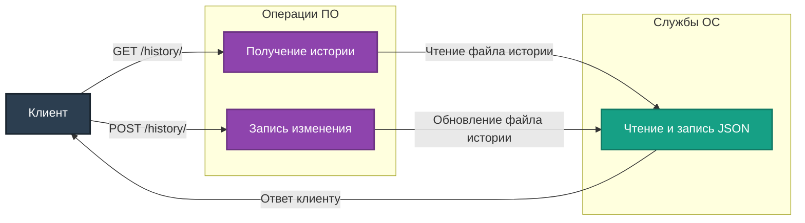

# Описание маршрутов "History"

Директория `app/routes/history` содержит маршруты для управления историей изменений в проекте. Все маршруты используют `Blueprint` для модульности и удобства масштабирования.

## Подключение
Для регистрации маршрутов в приложении используется файл `app/__init__.py`:
```python
from app.routes.history import history_bp
app.register_blueprint(history_bp, url_prefix='/history')
```

## Маршруты

### 1. **GET /history/**
**Описание:** Получение истории изменений.

- **Параметры:** отсутствуют.
- **Ответы:**
  - `200 OK` – Возвращает JSON с историей изменений.
  - `404 Not Found` – Лог-файл истории отсутствует.

Пример ответа:
```json
[
    {
        "timestamp": 1671234567,
        "description": "Создан новый файл.",
        "affected_files": ["file1.py", "file2.py"]
    }
]
```

---

### 2. **POST /history/**
**Описание:** Запись изменения в историю.

- **Параметры (JSON):**
  - `description` (string, обязательный) – Описание изменения.
  - `affected_files` (list, необязательный) – Список затронутых файлов.

- **Ответы:**
  - `201 Created` – Изменение успешно записано.
  - `400 Bad Request` – Отсутствует обязательный параметр `description`.

Пример запроса:
```json
{
    "description": "Обновлён файл конфигурации.",
    "affected_files": ["config.py"]
}
```

---

## Диаграмма взаимодействия



---

## Примечания
- История изменений сохраняется в файле `history_log.json`.
- Реализована обработка ошибок, таких как отсутствие файла или некорректные параметры запроса.