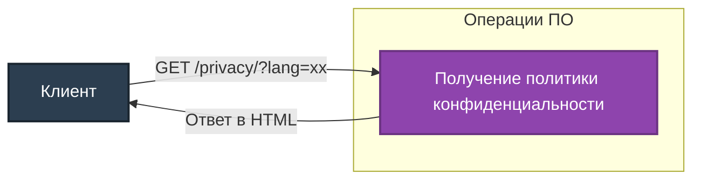

# Описание маршрутов "Privacy"

Директория `app/routes/privacy` содержит маршруты для предоставления политики конфиденциальности. Все маршруты используют `Blueprint` для модульности и удобства масштабирования.

## Подключение
Для регистрации маршрутов в приложении используется файл `app/__init__.py`:
```python
from app.routes.privacy import privacy_bp
app.register_blueprint(privacy_bp, url_prefix='/privacy')
```

## Маршруты

### 1. **GET /privacy/**
**Описание:** Предоставление политики конфиденциальности на различных языках.

- **Параметры (query):**
  - `lang` (string, необязательный) – Код языка (по умолчанию: `en`).

  Поддерживаемые языки:
  - `en` – Английский (по умолчанию).
  - `ru` – Русский.
  - `de` – Немецкий.
  - `fr` – Французский.
  - `zh` – Китайский.

- **Ответы:**
  - `200 OK` – Возвращает HTML с текстом политики конфиденциальности.

Пример запросов и ответов для каждого языка:

**1. Английский (по умолчанию):**
```
GET /privacy/
```
```html
<h1>Privacy Policy</h1>
<p>Your data is protected. We do not share personal information with third parties.</p>
```

**2. Русский:**
```
GET /privacy/?lang=ru
```
```html
<h1>Политика конфиденциальности</h1>
<p>Ваши данные защищены. Мы не передаём личные данные третьим лицам.</p>
```

**3. Немецкий:**
```
GET /privacy/?lang=de
```
```html
<h1>Datenschutz-Bestimmungen</h1>
<p>Ihre Daten sind geschützt. Wir geben keine persönlichen Daten an Dritte weiter.</p>
```

**4. Французский:**
```
GET /privacy/?lang=fr
```
```html
<h1>Politique de confidentialité</h1>
<p>Vos données sont protégées. Nous ne partageons pas d'informations personnelles avec des tiers.</p>
```

**5. Китайский:**
```
GET /privacy/?lang=zh
```
```html
<h1>隐私政策</h1>
<p>您的数据是受保护的。我们不会与第三方共享个人信息。</p>
```

---

## Диаграмма взаимодействия



---

## Примечания
- Тексты политики конфиденциальности хранятся в памяти в виде словаря.
- При отсутствии запрашиваемого языка используется английский (`en`) как язык по умолчанию.