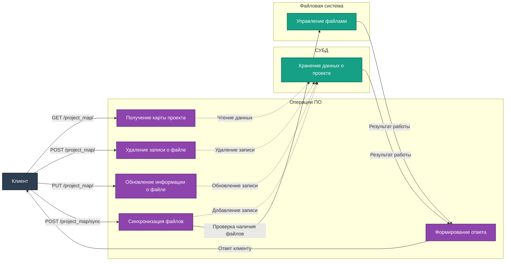

# Описание маршрутов "Project Map"

Директория `app/routes/project_map` содержит маршруты для управления картой проекта. Все маршруты используют `Blueprint` для модульности и удобства масштабирования.

## Подключение
Для регистрации маршрутов в приложении используется файл `app/__init__.py`:
```python
from app.routes.project_map import project_map_bp
app.register_blueprint(project_map_bp, url_prefix='/project_map')
```

## Маршруты

### 1. **GET /project_map/**
**Описание:** Получение карты проекта из базы данных.

- **Параметры:** отсутствуют.
- **Ответы:**
  - `200 OK` – Возвращает JSON с картой проекта.
  - `500 Internal Server Error` – Ошибка при получении данных.

Пример ответа:
```json
[
    {
        "path": "file1.py",
        "type": "file",
        "description": "Main application file",
        "size": 1024,
        "last_modified": "2025-01-15T12:34:56"
    }
]
```

---

### 2. **POST /project_map/**
**Описание:** Удаление записи о файле из карты проекта (СУБД).

- **Параметры (JSON):**
  - `path` (string, обязательный) – Путь к удаляемому файлу.

- **Ответы:**
  - `200 OK` – Запись успешно удалена.
  - `400 Bad Request` – Отсутствует обязательный параметр `path`.
  - `404 Not Found` – Файл не найден в карте проекта.

Пример запроса:
```json
{
    "path": "file1.py"
}
```

---

### 3. **PUT /project_map/**
**Описание:** Обновление информации о файле в карте проекта.

- **Параметры (JSON):**
  - `path` (string, обязательный) – Путь к файлу.
  - `description` (string, обязательный) – Новое описание файла.

- **Ответы:**
  - `200 OK` – Информация успешно обновлена.
  - `400 Bad Request` – Отсутствуют обязательные параметры.
  - `404 Not Found` – Файл не найден в карте проекта.
  - `500 Internal Server Error` – Ошибка при обновлении данных.

Пример запроса:
```json
{
    "path": "file1.py",
    "description": "Updated application file"
}
```

---

### 4. **POST /project_map/sync**
**Описание:** Синхронизация файлов из массива JSON с картой проекта. Проверяет существование файлов и добавляет их в СУБД.

- **Параметры (JSON):**
  Массив объектов с полями:
  - `path` (string, обязательный) – Путь к файлу.
  - `description` (string, обязательный) – Описание файла.

Пример запроса:
```json
[
    {"path": "file1.py", "description": "Main application file"},
    {"path": "file2.py", "description": "Secondary file"}
]
```

- **Ответы:**
  - `200 OK` – Все файлы успешно синхронизированы.
  - `207 Multi-Status` – Часть файлов не найдена, остальные успешно синхронизированы.
  - `404 Not Found` – Ни один файл не найден.
  - `400 Bad Request` – Некорректный формат запроса.

Пример ответа (Multi-Status):
```json
{
    "message": "Some files were not found.",
    "details": {
        "synchronized": ["file1.py"],
        "not_found": ["file2.py"]
    }
}
```

---

## Диаграмма взаимодействия



---

## Примечания
- Карта проекта хранится в СУБД и синхронизируется с файловой системой.
- Реализована обработка ошибок, таких как отсутствие файла или некорректные параметры запроса.