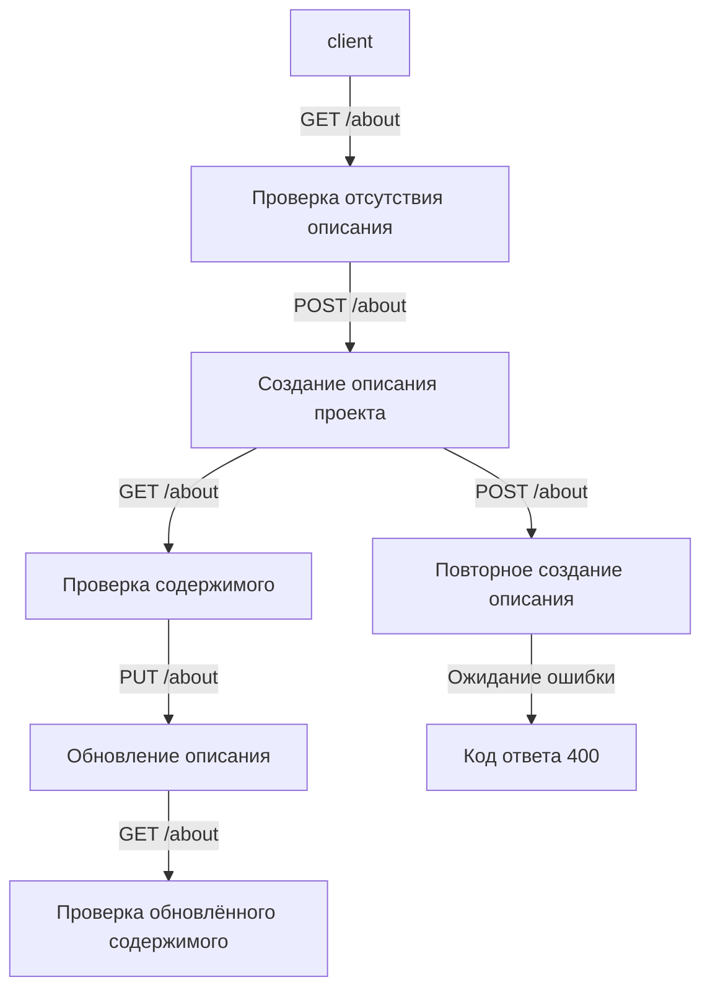
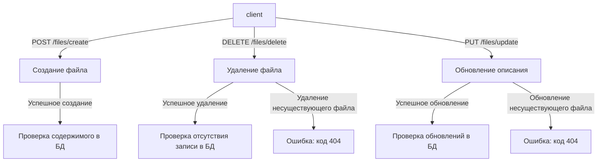
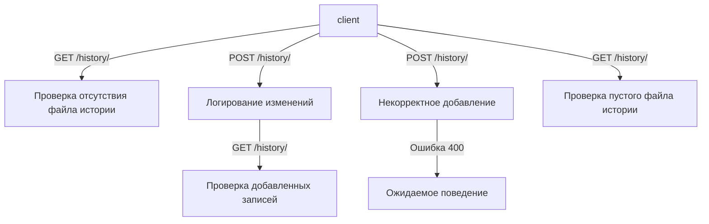
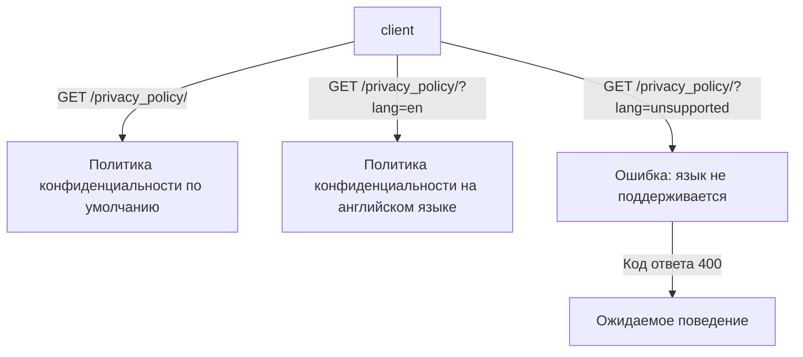
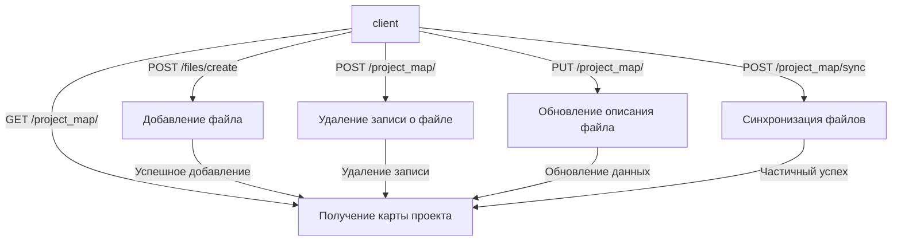

# Документация по тестам

## Общая информация

Тесты в проекте предназначены для проверки функциональности маршрутов, работы с СУБД и корректной интеграции. 
Все тесты используют `pytest` и базируются на фикстурах, определённых в `tests/conftest.py`.

## Фикстуры

Фикстуры определены в файле `tests/conftest.py` и включают:

1. **`temp_test_dir`**
   - Создаёт временную директорию для тестовых данных.
   - Используется для хранения временных файлов, таких как база данных SQLite и тестовые данные.

2. **`app`**
   - Создаёт тестовый экземпляр Flask-приложения с использованием временной конфигурации.
   - Инициализирует базу данных перед тестами.

3. **`client`**
   - Предоставляет тестовый клиент Flask для выполнения запросов к API.

## Тесты для `about`

Тесты расположены в `tests/test_about.py` и включают следующие проверки:

### 1. **`test_get_about_empty`**
- **Описание:** Проверяет поведение при попытке получить описание проекта, если оно отсутствует.
- **Запрос:** `GET /about`
- **Ожидаемый результат:**
  - Код ответа: `404`
  - Сообщение: `{ "error": "Project description does not exist." }`

### 2. **`test_create_and_get_about`**
- **Описание:** Проверяет создание описания проекта и последующее получение данных.
- **Шаги:**
  1. Отправляется запрос `POST /about` с описанием проекта.
  2. Проверяется, что файл `project_description.json` создан во временной директории.
  3. Выполняется запрос `GET /about` для проверки сохранённого описания.
- **Ожидаемый результат:**
  - Код ответа: `201` при создании.
  - Код ответа: `200` при получении.

### 3. **`test_update_about`**
- **Описание:** Проверяет обновление описания проекта.
- **Шаги:**
  1. Отправляется запрос `PUT /about` с новым описанием.
  2. Проверяется обновлённый файл во временной директории.
  3. Выполняется запрос `GET /about` для проверки обновлений.
- **Ожидаемый результат:**
  - Код ответа: `200` при обновлении.
  - Обновлённое описание в ответе.

### 4. **`test_create_about_already_exists`**
- **Описание:** Проверяет поведение при попытке повторного создания описания проекта.
- **Запрос:** `POST /about`
- **Ожидаемый результат:**
  - Код ответа: `400`
  - Сообщение: `{ "error": "Project description already exists." }`

### Диаграмма выполнения тестов для `test_about.py`



## Тесты для `files`

Тесты расположены в `tests/test_files.py` и включают следующие проверки:

### 1. **`test_create_file_missing_filename`**
- **Описание:** Проверяет поведение при создании файла без указания имени.
- **Запрос:** `POST /files/create`
- **Ожидаемый результат:**
  - Код ответа: `400`
  - Сообщение: `{ "error": "Filename is required." }`

### 2. **`test_create_file_success`**
- **Описание:** Проверяет успешное создание файла.
- **Запрос:** `POST /files/create`
- **Ожидаемый результат:**
  - Код ответа: `201`
  - Сообщение: `"File 'test.txt' created successfully."`

### 3. **`test_delete_file`**
- **Описание:** Проверяет удаление существующего файла.
- **Шаги:**
  1. Создаётся файл через запрос `POST /files/create`.
  2. Выполняется запрос `DELETE /files/delete` для удаления файла.
- **Ожидаемый результат:**
  - Код ответа: `200`
  - Сообщение: `"File 'test.txt' deleted from project database."`

### 4. **`test_delete_file_nonexistent`**
- **Описание:** Проверяет удаление несуществующего файла.
- **Запрос:** `DELETE /files/delete`
- **Ожидаемый результат:**
  - Код ответа: `404`
  - Сообщение: `"File 'nonexistent.txt' does not exist."`

### 5. **`test_update_file`**
- **Описание:** Проверяет успешное обновление описания файла.
- **Шаги:**
  1. Создаётся файл через запрос `POST /files/create`.
  2. Выполняется запрос `PUT /files/update` для обновления описания файла.
- **Ожидаемый результат:**
  - Код ответа: `200`
  - Сообщение: `"File 'test.txt' information updated successfully."`

### 6. **`test_update_file_nonexistent`**
- **Описание:** Проверяет обновление описания для несуществующего файла.
- **Запрос:** `PUT /files/update`
- **Ожидаемый результат:**
  - Код ответа: `404`
  - Сообщение: `"File 'nonexistent.txt' does not exist."`

### Диаграмма выполнения тестов для `test_files.py`




## Тесты для маршрутов History

Этот файл описывает тесты, расположенные в `tests/test_history.py`, и их цели.

### 1. **`test_missing_history_file`**
- **Описание:** Проверяет поведение при попытке получить историю, если файл истории отсутствует.
- **Запрос:** `GET /history/`
- **Ожидаемый результат:**
  - Код ответа: `404`
  - Сообщение: `{ "error": "History log file does not exist." }`

### 2. **`test_log_and_get_history`**
- **Описание:** Проверяет добавление записей в историю и получение истории изменений.
- **Шаги:**
  1. Отправляется запрос `POST /history/` с данными изменения.
  2. Выполняется запрос `GET /history/` для проверки сохранённых изменений.
- **Ожидаемый результат:**
  - Код ответа: `201` при добавлении записи.
  - Код ответа: `200` при получении истории.
  - Проверка всех добавленных записей.

### 3. **`test_invalid_log_entry`**
- **Описание:** Проверяет поведение при некорректных данных для добавления записи.
- **Запрос:** `POST /history/`
- **Ожидаемый результат:**
  - Код ответа: `400`
  - Сообщение: `{ "error": "Description is required." }`

### 4. **`test_empty_history_file_with_content`**
- **Описание:** Проверяет поведение при пустом файле истории.
- **Запрос:** `GET /history/`
- **Ожидаемый результат:**
  - Код ответа: `200`
  - Пустой массив в ответе: `[]`

### Диаграмма выполнения тестов




## Тесты для маршрутов Privacy

Этот файл описывает тесты, расположенные в `tests/test_privacy.py`, и их цели.

### 1. **`test_get_privacy_policy_default_language`**
- **Описание:** Проверяет получение политики конфиденциальности на языке по умолчанию (русский).
- **Запрос:** `GET /privacy_policy/`
- **Ожидаемый результат:**
  - Код ответа: `200`
  - Политика конфиденциальности возвращается на русском языке.

### 2. **`test_get_privacy_policy_specific_language`**
- **Описание:** Проверяет получение политики конфиденциальности на указанном языке (например, английский).
- **Запрос:** `GET /privacy_policy/` с параметром `?lang=en`
- **Ожидаемый результат:**
  - Код ответа: `200`
  - Политика конфиденциальности возвращается на английском языке.

### 3. **`test_get_privacy_policy_unsupported_language`**
- **Описание:** Проверяет поведение при запросе политики конфиденциальности на неподдерживаемом языке.
- **Запрос:** `GET /privacy_policy/` с параметром `?lang=unsupported`
- **Ожидаемый результат:**
  - Код ответа: `400`
  - Сообщение: `{ "error": "Language not supported." }`

### Диаграмма выполнения тестов




## Тесты для маршрутов Project Map

Этот файл описывает тесты, расположенные в `tests/test_project_map.py`, и их цели.

### 1. **`test_add_and_get_project_map`**
- **Описание:** Проверяет добавление файла в карту проекта и последующее получение карты проекта.
- **Шаги:**
  1. Отправляется запрос `POST /files/create` для добавления файла.
  2. Выполняется запрос `GET /project_map/` для проверки содержимого карты проекта.
- **Ожидаемый результат:**
  - Код ответа: `201` при добавлении файла.
  - Код ответа: `200` при получении карты проекта.
  - Проверяется, что добавленный файл присутствует в ответе.

### 2. **`test_delete_from_project_map`**
- **Описание:** Проверяет удаление записи о файле из карты проекта.
- **Шаги:**
  1. Создаётся файл через запрос `POST /files/create`.
  2. Выполняется запрос `POST /project_map/` для удаления записи.
  3. Проверяется карта проекта через `GET /project_map/`.
- **Ожидаемый результат:**
  - Код ответа: `200` при успешном удалении записи.
  - Удалённый файл отсутствует в карте проекта.

### 3. **`test_update_project_map`**
- **Описание:** Проверяет обновление информации о файле в карте проекта.
- **Шаги:**
  1. Создаётся файл через запрос `POST /files/create`.
  2. Выполняется запрос `PUT /project_map/` для обновления описания файла.
  3. Проверяется обновлённая информация через `GET /project_map/`.
- **Ожидаемый результат:**
  - Код ответа: `200` при успешном обновлении.
  - Обновлённая информация отражается в карте проекта.

### 4. **`test_sync_project_files`**
- **Описание:** Проверяет синхронизацию файлов из файловой системы с картой проекта.
- **Шаги:**
  1. Создаётся один файл на файловой системе.
  2. Выполняется запрос `POST /project_map/sync` с массивом файлов (один существующий, один отсутствующий).
  3. Проверяется статус ответа и содержимое карты проекта через `GET /project_map/`.
- **Ожидаемый результат:**
  - Код ответа: `207` (Multi-Status) при частичном успехе.
  - Синхронизированный файл присутствует в карте проекта.

### Диаграмма выполнения тестов



## Запуск тестов

### Обычный режим

Для проверки работы приложения с использованием автоматических тестов выполните следующие шаги:

1. Убедитесь, что у вас установлены все зависимости из `requirements.txt`:
   ```bash
   pip install -r requirements.txt
   ```

2. Запустите тесты с помощью команды:
   ```bash
   pytest tests
   ```

### Режим отладки

Для запуска с подробными логами выполните следующую команду:
```bash
pytest -s --log-cli-level=DEBUG tests
```
